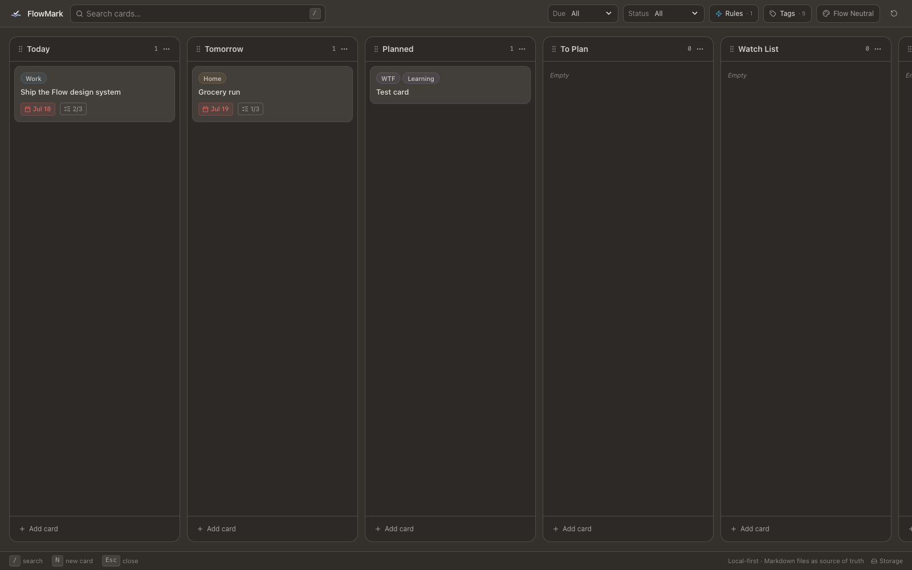

<p align="center">
  
</p>

<h1 align="center">Flowmark</h1>

<p align="center">
  The local-first task board that humans and coding agents can manage together.
</p>

Flowmark gives your coding agents a task system they can operate directly and
safely. Cards are Markdown, configuration is YAML, every change is visible in
Git, and strict validation catches broken references before the board starts.
An agent can create your workspace, turn a plan into cards, triage work, update
checklists, and configure automation without browser scripting or a proprietary
API.

You still get a calm, keyboard-friendly Kanban UI. It runs on your computer,
serves only on loopback, and stores every meaningful change in human-readable
files. There is no account, cloud service, telemetry, or hidden database.



## Give your agent a real task board

Run `flowmark init` in any project directory. It creates the task workspace and
an `AGENTS.md` contract that teaches coding agents how to inspect schemas, edit
resources, and validate their work without silently damaging user data.

```sh
cd your-project
flowmark init
```

Then start your preferred coding agent in that directory and ask your agent:

```text
Use Flowmark to manage work in this repository. Read AGENTS.md first.
Create a practical board with Backlog, Ready, In Progress, Blocked, and Done.
Add useful tags and rules, then run flowmark validate --strict.
```

```text
Turn the implementation plan in docs/new-sync-engine.md into Flowmark cards.
Keep each card independently actionable, add acceptance criteria as checklists,
preserve dependency order, and validate the workspace when finished.
```

```text
Review my Flowmark workspace. Close tasks already completed in Git, identify
stale or blocked work, update the relevant cards, and show me the resulting
task-file diff. Do not change application source code.
```

```text
Configure Flowmark rules so completed cards move to Done, cards entering Today
receive today's due date, and every column remains sorted by due date. Query
flowmark schema rule before editing YAML and run strict validation afterward.
```

Agents and the UI share one source of truth:

```text
Agent edits Markdown/YAML ──► flowmark validate --strict ──► Flowmark UI
            ▲                                                   │
            └──────────────── reviewable Git diff ◄─────────────┘
```

The live schema commands keep prompts useful across Flowmark releases:

```sh
flowmark schema --all
flowmark schema card --format json
flowmark schema rule
flowmark validate --strict
```

This makes Flowmark useful for autonomous planning and maintenance while
keeping the human in control: inspect the files, review the diff, or edit any
resource by hand.

## Why Flowmark?

- **Built for agents, not integrations.** Agents use ordinary filesystem tools,
  discover current schemas from the CLI, and leave reviewable task diffs.
- **Your files are the product.** Cards and comments are Markdown; columns,
  tags, rules, checklists, and templates are YAML.
- **Local and offline by default.** The UI binds to `127.0.0.1` and makes no
  runtime network requests.
- **Friendly to Git and agents.** One resource per file, immutable IDs,
  deterministic validation, machine-readable schemas, and reviewable diffs.
- **Useful automation without hidden state.** Rules can route, date, tag,
  complete, archive, and sort cards. Startup reconciliation catches missed
  date transitions.
- **A focused board.** Drag and drop, Markdown descriptions/comments/checklists,
  tag filtering, due dates, keyboard saving, and eight workspace themes.
- **One executable.** The release binary contains the CLI, server, UI, and
  background scheduler.

## Install

Install the latest release into `~/.local/bin`:

```sh
curl -fsSL https://raw.githubusercontent.com/carlosray/flowmark/master/install.sh | sh
```

The installer supports Apple Silicon and Intel macOS plus x86-64 Linux,
downloads the matching archive, verifies it against the release's
`SHA256SUMS`, and installs without elevated permissions. Ensure
`~/.local/bin` is on your `PATH`, then run:

```sh
flowmark --help
```

Update an existing standalone installation to the latest stable release:

```sh
flowmark update
```

This is the only normal Flowmark command that uses network access. It downloads
the matching release, verifies its SHA-256 checksum, and atomically replaces the
currently running executable. After updating, restart any running Flowmark
sessions so they use the new binary.

Choose another directory or pin a release:

```sh
curl -fsSL https://raw.githubusercontent.com/carlosray/flowmark/master/install.sh |
  FLOWMARK_INSTALL_DIR="$HOME/bin" sh

curl -fsSL https://raw.githubusercontent.com/carlosray/flowmark/master/install.sh |
  FLOWMARK_VERSION=v0.1.0 sh
```

To inspect the script before running it:

```sh
curl -fsSL https://raw.githubusercontent.com/carlosray/flowmark/master/install.sh \
  -o /tmp/flowmark-install.sh
less /tmp/flowmark-install.sh
sh /tmp/flowmark-install.sh
```

### Manual installation

Download the binary for your platform from the
[latest release](../../releases/latest):

| Platform            | Asset                          |
| ------------------- | ------------------------------ |
| Apple Silicon macOS | `flowmark-darwin-arm64.tar.gz` |
| Intel macOS         | `flowmark-darwin-x64.tar.gz`   |
| x86-64 Linux        | `flowmark-linux-x64.tar.gz`    |

Download `SHA256SUMS` beside the archive and verify it with
`sha256sum -c SHA256SUMS` on Linux or `shasum -a 256 -c SHA256SUMS` on macOS.
Then extract the archive and place its `flowmark` executable on your `PATH`:

```sh
tar -xzf flowmark-darwin-arm64.tar.gz # choose the archive for your platform
install -m 0755 flowmark ~/.local/bin/flowmark
flowmark --help
```

macOS may attach a quarantine attribute to unsigned downloads. If Finder
blocks a binary you trust, remove that attribute explicitly:

```sh
xattr -d com.apple.quarantine ~/.local/bin/flowmark
```

To run from source instead, install [Bun](https://bun.sh/) and use:

```sh
bun install
bun link
```

Flowmark does not require network access after installation unless you
explicitly run `flowmark update`.

## Quick start

```sh
mkdir my-tasks
cd my-tasks
flowmark init
flowmark
```

Open the printed `http://127.0.0.1:…/` address. `flowmark init` is idempotent:
running it again verifies the existing workspace without replacing your files.

Run Flowmark in the background:

```sh
flowmark --daemon
flowmark list
flowmark stop <session-id>
```

Sessions are discoverable from every directory through
`~/.flowmark/sessions.json`. The registry contains only process metadata and
can be rebuilt; task content never lives there.

## Open card links from agents

Flowmark can generate a link for an active card without hardcoding the UI port:

```sh
flowmark link card_example
flowmark link card_example --format markdown
```

The command validates the card and resolves the live session for the current
workspace. Generated `AGENTS.md` guidance starts with paths only, asks once
whether live links should be included in future responses, and records that
choice without changing unrelated agent instructions.

On macOS, install the local `flowmark://` handler once from the standalone
binary:

```sh
flowmark links install
```

The standalone server prefers port `3000`, matching a Safari Web App installed
from Flowmark's default local URL, and falls back to a free dynamic port when
that port is occupied. Opening a generated link reuses an installed
`~/Applications/FlowMark.app` when its configured origin matches the live
session. Otherwise it activates an existing Safari tab for the session; if no
matching tab exists, it opens the card in a new Safari tab.
macOS may ask once for permission to control Safari. The handler is rebuildable
runtime state under `~/.flowmark/apps/`; reinstall it after deleting
`~/.flowmark/` or moving the Flowmark executable.

## Files are the database

```text
my-tasks/
├── flowmark.yaml
├── cards/          # Markdown with YAML frontmatter
├── columns/        # YAML
├── tags/           # YAML
├── rules/          # YAML
├── comments/       # Markdown with YAML frontmatter
├── checklists/     # YAML
├── templates/      # YAML
├── archive/        # Archived source resources
└── .flowmark/      # Disposable runtime data; ignored by Git
```

Flowmark validates the complete graph before the UI or scheduler starts. Bad
fields, duplicate IDs, filename mismatches, unsupported versions, and broken
references produce stable error codes with a file, field, explanation, and
suggested fix.

```sh
flowmark validate --strict
flowmark schema card --format json
flowmark schema rule
flowmark schema --all
flowmark repair
```

`repair` only rebuilds disposable `.flowmark/` state. It never changes
authoritative task files. Flowmark does not silently migrate or rewrite a
workspace on startup.

## Rules

Columns store structure, not behavior. Automations are explicit files in
`rules/`:

```yaml
schema_version: 1
id: rule_today_due_date
name: Set due date when moved to Today
enabled: true
trigger:
  type: card_entered_column
  column_id: column_today
actions:
  - type: set_due_date
    mode: end_of_day
created_at: 2026-07-20T09:00:00Z
updated_at: 2026-07-20T09:00:00Z
```

Rules run as bounded, deterministic transactions. Unchanged actions are
no-ops, cascades are loop-protected, and derived changes are written back to
the same card files. See [Rules](docs/rules.md) for the complete model.

## Documentation

- [Workspace format](docs/workspace-format.md)
- [Rule engine](docs/rules.md)
- [Architecture](docs/architecture.md)
- [Contributing](CONTRIBUTING.md)
- [Security policy](SECURITY.md)

The `example/` directory is a complete workspace that can be opened with:

```sh
cd example
bun run ../src/cli.ts
```

## Development

```sh
bun install
bun run dev
bun run test
bun run typecheck
bun run lint
bun run format:check
bun run build
bun run binary
bun run test:binary
```

The binary smoke test copies the executable to a temporary directory and
verifies initialization, strict validation, daemon startup, rendered assets,
global session listing, and shutdown.

## Status

Flowmark is an early public release. The workspace format is deliberately
strict; preserve compatibility when extending it, and use explicit schema
versions for future changes. Bug reports and focused contributions are
welcome.

## License

[MIT](LICENSE)
